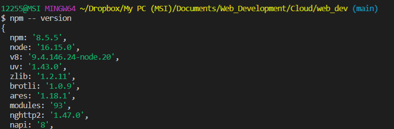
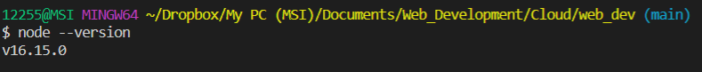
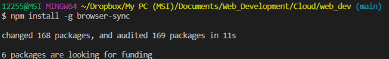
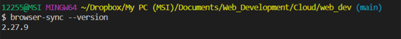
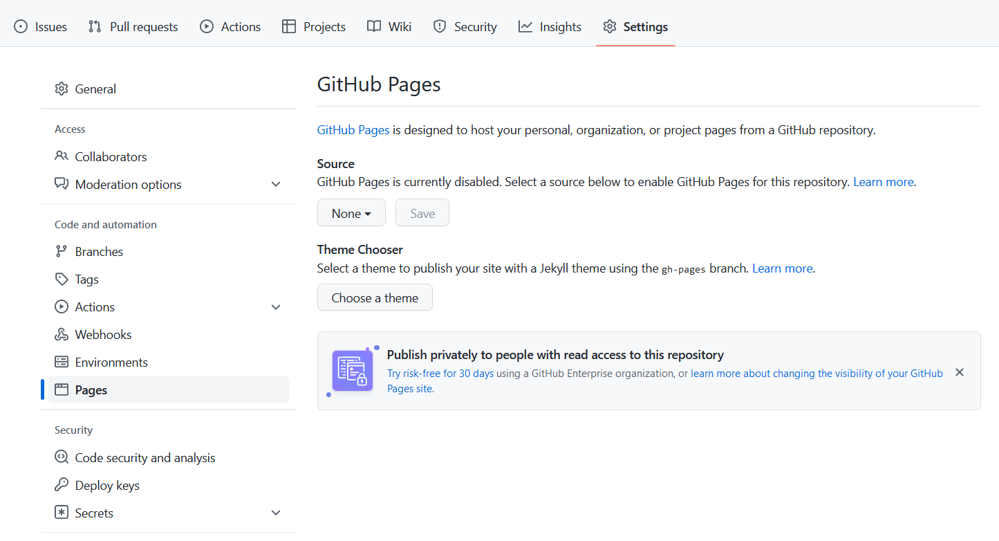
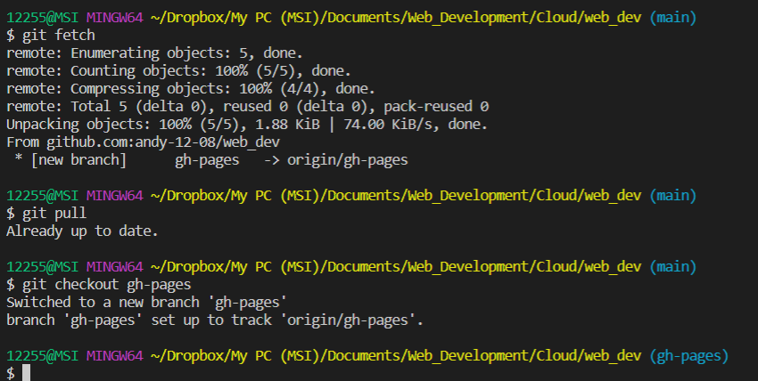

## The following tools will be required for developing our websites 
(1)  Google chrome Browser
- Already comes with CDT (Chrome Developer Tools)

(2) Sublime text 

(3) Git

(4) Browser sync
- we need to install NodeJS for this to work

Ensure that npm (node package manager) is installed and working

Ensure browser sync is installed 

## Prepare your repository to host your website
On your repository, go to settings > Pages and create "gh-pages" branch

Check out this link for more information on how to do this:
[click here](https://happycoding.io/tutorials/html/github-pages)

To update your current local files with those changes you've made on your repository ( "git status", "git fetch", "git pull", "git status")
Leave your main branch and go into your "gh-pages" branch ("git checkout gh-pages").

Note that only the contents of the "gh-pages" branch gets published on your site.

Update changes ("git add .", "git commit -mgit  'changes'", "git push")

