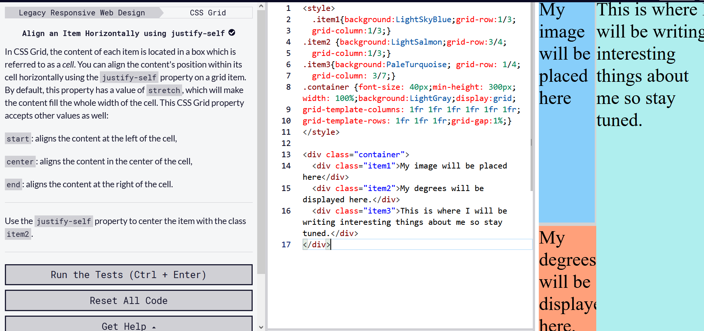

### Some of the new things I learnt from building this page:
- I used CSS flex for building the menu bar, this functionality in aligning the row and spacing them. I converted the list to inline elements then embed them in a container whoose display was set to *flex*. This gave me a good understanding of how *flex* really works. 
 

- I made use of CSS grid in the section below the header. I made use of 3 by 6 grid and this hlped me to position the elements containing (the degrees, the image, the biography) This was later changed to 3 by 8 grid to obtain a better positioning of the image.From this I saw that:
      
    
    - ONLY width really matters: your height does not really effect until you begin to place tour contents.  

    - Choosing the grid size is also crusial to ensuring a good alignment/space management of elements within the grid.

- This image represents a  3 x 6 grid: 
 

 

- A negative margin (-1%) on the header helped to push it out to the top and edges of the window.

