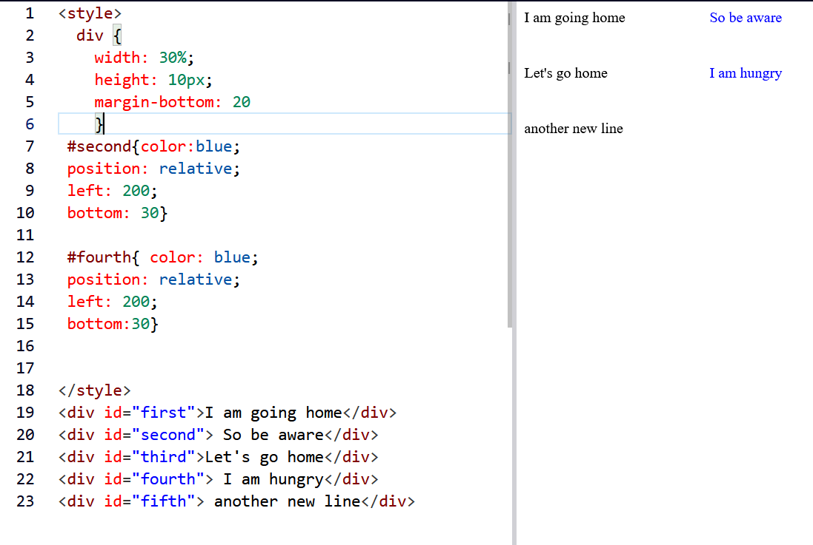
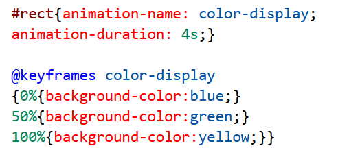
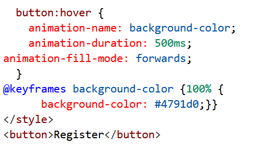

### In this project, I designed a simple web page using HTML and CSS. This project made me understand the importance of division element in specifying different parts of the web page for ease of styling.
### A few take home here are:
- While adjusting the distance between elments, first add padding (in all four directions) and preview, then go ahead to add the right set of padding distances before adding your margin.  

- To centralize a group of text under a given division element (a very important block elment), explore adjusting the width, aligning, ad most importantly; relative position specification.  

- margin: auto; helped me to centralize very well, so that it displays well across various screen size. 

- Also try as much as possible to keep your work neat.

- To avoid bolding your text, you can start a new line with the p element (a block element)

### Random Tips

- When trying to style elements to look like a table, use a consistent div element selector and id selector to place each entry. See the figure below.
 
 

 
 

- Sometimes you could decide to add an animation to your background color. You can do this by creating an id selector and defining the animation-name and animation-duration, then setting aa keyframe for the different color transitions.
 
 

 
 

 
Animation apllied to a button on hovering around it

For more information on more cool animations, visit the links below:
 

[up_down/left_right](https://www.freecodecamp.org/learn/responsive-web-design/applied-visual-design/create-movement-using-css-animation) 
[bounce](https://www.freecodecamp.org/learn/responsive-web-design/applied-visual-design/animate-elements-continually-using-an-infinite-animation-count)

